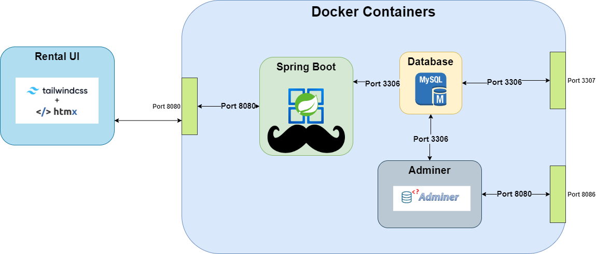

# 

  <a href="#bulb-about">About</a> &nbsp;&bull;&nbsp;
  <a href="#classical_building-architecture-overview">Architecture Overview</a> &nbsp;&bull;&nbsp;
  <a href="#arrows_clockwise-running-application">Running Application</a></a> &nbsp;&bull;&nbsp;
  <a href="#toolbox-tech-stacks-and-tools">Tech Stacks And Tools</a>&nbsp;

 

## :bulb: About

A POC rental application that demonstrates the use of Java, Spring Boot, HTMX, Mustache, Tailwind CSS. I chose this 
stack primarily because I wanted to use this opportunity to learn some different frontend technologies that I've never used.
It was a fun thought experiment :-)

## :classical_building: Architecture Overview

## :arrows_clockwise: Running Application

### Prerequisites

- [Docker](https://www.docker.com/) - Used to build and run application without requiring all technologies and resources locally.

### Getting Started

1. Clone this repo from GitHub.
2. Open a terminal/command prompt into the project directory and run `docker compose up -d`
3. This command should execute the `docker-compose.yml` file which builds and runs the application in the background.
4. A database, and data, will be initialized and seeded with test data configured via `application.properties` file.
5. Open a browser and go to `http://localhost:8080/products`

## :toolbox: Tech Stacks And Tools

### Rental Application UI And API

- [Spring Boot](https://spring.io/projects/spring-boot) - Spring Boot makes it easy to create stand-alone, production-grade Spring-based Applications;
- [HTMX](https://htmx.org/) - HTMX allows you to access AJAX, CSS Transitions, WebSockets and Server Sent Events directly in HTML, using attributes;
- [Mustache](https://mustache.github.io/) - Mustache is a logic-less template syntax that can be used for HTML, config files, source code - anything;
- [Tailwind CSS](https://tailwindcss.com/) - A utility-first CSS framework for rapidly building custom user interfaces;
- [Maven](https://maven.apache.org/) - Apache Maven is a software project management and comprehension tool.

### Rental Application Backend

- [Spring Data JPA](https://spring.io/projects/spring-data-jpa) - Simplifies data access layers by reducing boilerplate code and providing a more fluid programming model;
- [MySQL](https://www.mysql.com/) - An open-source relational database management system;
- [Docker](https://www.docker.com/) - Docker is an open platform for developing, shipping, and running applications in containers;
- [JDK 21](https://openjdk.java.net/) - The Java Development Kit used to develop Java applications (Note: Adjust version as per availability and project requirements).

### DevOps & CI/CD

- [GitHub Actions](https://github.com/features/actions) - Automation tool for continuous integration and continuous deployment pipelines;
- [Docker Compose](https://docs.docker.com/compose/) - A tool for defining and running multi-container Docker applications.

### Development Tools

- [IntelliJ IDEA](https://www.jetbrains.com/idea/) - Advanced editor and Java IDE.
- [Adminer](https://www.adminer.org/) - Small and simple PHP based UI for administrating MySQL.
